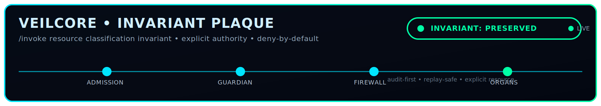
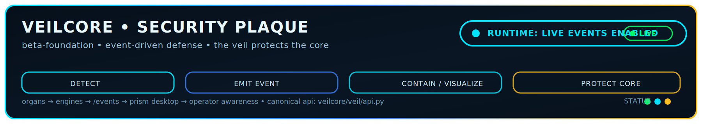

cat > README.md <<'EOF'
<p align="center">
  
</p>

<p align="center">
  
</p>

<p align="center">
  
</p>

<p align="center">
  
  
  
  
</p>

<p align="center">
  
  
  
</p>

<p align="center"><em>"I stand between chaos and those I protect"</em></p>

---

## 🔱 What is VeilCore?

**VeilCore** is an event-driven cyber defense platform for hospitals and critical infrastructure.

It is built around one rule:

## **The Veil protects the Core.**

Instead of trusting perimeter tools alone, VeilCore places a defensive veil of organs, engines, event handling, visibility systems, and containment logic between hostile activity and protected infrastructure.

Attackers should interact with the **Veil**, not the **Core**.

VeilCore is designed to preserve continuity, reduce ransomware impact, improve operator awareness, strengthen accountability, and bring cyber + physical security into one platform.

**Built by Marlon Ástin Williams.**

---

## ⚡ Current Beta-Foundation Reality

VeilCore currently includes a working platform foundation with:

- live FastAPI backend
- `/events` event stream
- engine control routes
- Prism desktop/dashboard runtime
- subsystem cards and event visualization
- physical engine integration
- ML engine state testing
- in-platform terminal workflow
- accessibility engine direction
- organ-based architecture
- security documentation and policy layer
- cleaned repository structure with canonical runtime paths

This repository reflects the **beta-foundation** state of the platform.

---

## 🏗️ Architecture

<p align="center">
  
</p>

<p align="center">
  
</p>

### Core Model

#### Veil
The Veil is the defensive interaction layer.

It is responsible for:

- interception
- challenge
- containment
- deception
- delay
- event generation
- controlled visibility

#### Core
The Core is the protected truth layer.

It is responsible for:

- policy truth
- identity trust
- continuity
- accountability
- protected system state
- command authority

#### Organs and Engines
VeilCore is composed of modular organs and subsystem engines.

Relevant source areas include:

- `veilcore/organs/`
- `veilcore/organ_specs/`
- `veilcore/core/`
- `veilcore/veil/api.py`
- `scripts/veilcore_desktop.py`

Detailed architecture documentation:

- `docs/VEILCORE_ARCHITECTURE.md`
- `docs/ARCHITECTURE.md`
- `docs/API_SOURCE_OF_RECORD.md`
- `docs/RUNTIME_PATHS.md`
- `docs/IMMUTABILITY_AND_ACCOUNTABILITY.md`

---

## 🧬 80-Organ Architecture

VeilCore is built around an **80-organ architecture**.

Organs are modular defensive and operational units that monitor, react, emit state, and participate in coordinated system defense.

Primary organ source area:

- `veilcore/organs/`

Primary organ specification area:

- `veilcore/organ_specs/`

Examples include:

- analytics
- audit
- auth
- auto_lockdown
- backup
- firewall
- forensic
- guardian
- hospital
- insider_threat
- metrics
- quarantine
- sentinel
- telemetry
- vault
- zero_trust

Each organ is part of a larger living defensive model rather than a single monolithic security tool.

---

## ⚙️ Engine Layer

Subsystem engines live in:

- `veilcore/core/`

Examples include:

- `core/accessibility`
- `core/cloud`
- `core/compliance`
- `core/federation`
- `core/mesh`
- `core/ml`
- `core/mobile`
- `core/pentest`
- `core/physical`
- `core/wireless`

These engines provide capabilities such as:

- machine learning threat scoring
- penetration simulation
- wireless defense
- physical security integration
- accessibility support
- cloud and federation support

---

## 🌊 Event-Driven Defense

VeilCore is event-driven.

Events are produced when engines or organs change state or detect conditions.

Examples include:

- `engine.degraded`
- `engine.restarted`
- `physical.camera_feed_lost`
- `physical.sensor_triggered`

These events are used for:

- dashboard visibility
- threat awareness
- system reaction
- operator insight
- future automation chains

This event fabric is one of the core defensive systems of the platform.

---

## 🖥️ Desktop / Prism Layer

The current desktop runtime is centered on the VeilCore desktop and Prism event presentation.

Primary runtime files include:

- `scripts/veilcore_desktop.py`
- `scripts/prism_events.py`

The desktop currently provides:

- subsystem health cards
- event feed visualization
- mesh / overlay visuals
- telemetry display
- integrated terminal behavior
- operator awareness

This is not intended to be a passive dashboard only. It is the operator-facing expression of the event-driven defense model.

---

## 🧠 Accessibility

VeilCore includes an accessibility direction as a core platform concern.

Relevant source area:

- `veilcore/core/accessibility/`

This includes support work for:

- audio interaction
- screen reader support
- braille-oriented functionality
- accessible operator interaction

Accessibility is treated as a platform concern, not an afterthought.

---

## 🏥 Hospital Focus

VeilCore is designed for environments where continuity matters.

That includes systems and workflows around:

- hospital infrastructure
- clinical operations
- HL7 / FHIR related integrations
- physical security events
- medical network protection
- ransomware resilience
- operator accountability

The platform is intended to help hospitals preserve operational continuity under attack pressure.

---

## 🔐 Security and Accountability

VeilCore is intended to support:

- event traceability
- operator accountability
- immutable security direction
- incident visibility
- policy-driven defensive response

Relevant materials are documented in:

- `veilcore/security/`
- `docs/IMMUTABILITY_AND_ACCOUNTABILITY.md`

This is part of the long-term direction of the platform: a system where actions, decisions, and state changes are attributable and difficult to silently erase or deny.

---

## 🚀 Canonical Runtime

### API
```bash
uvicorn veilcore.veil.api:app --host 127.0.0.1 --port 9444
