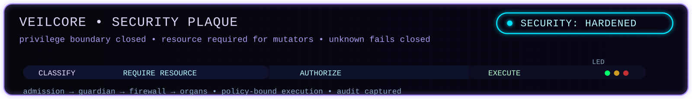
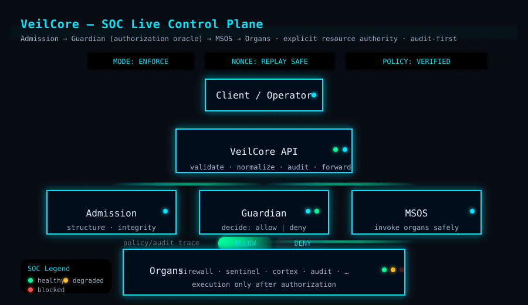

<p align="center">
  
</p>

<p align="center">
  
</p>

<p align="center">
  
  
  
  
  
</p>

<p align="center">
  
</p>

<p align="center">
  
  
  
</p>

<p align="center"><em>"I stand between chaos and those I protect"</em></p>

<br/>

---

<br/>

## 🔱 What is VeilCore?

**VeilCore** is a living cybersecurity defense system purpose-built for hospitals. It wraps around critical healthcare infrastructure — Epic EHR, Imprivata SSO, HL7 messaging, FHIR APIs, DICOM imaging — and protects it from ransomware, insider threats, zero-day exploits, and advanced persistent threat groups.

It doesn't replace your hospital systems. **It becomes their immune system.**

VeilCore operates as **80 specialized security organs**, each running as an independent systemd service on Ubuntu, organized into three priority tiers. **17 advanced subsystems** extend the organs with mesh communication, machine learning, cross-hospital federation, automated penetration testing, remote monitoring, accessibility, wireless protection, physical security fusion, bare-metal deployment, hospital onboarding, compliance certification, and federal authorization mapping.

> 💡 **Why "organs"?** Just like a human body has specialized organs working together to keep you alive, VeilCore has specialized security components working together to keep your hospital alive. If one organ detects a threat, the entire system responds. Remove The Veil and you go blind.

**Built solo by Marlon Ástin Williams in 2025.**

<br/>

---

<br/>

## 🏗️ Architecture

<p align="center">
  
</p>

<br/>

<p align="center">
  
</p>

---

<br/>
<!-- ORGANS:BEGIN -->
## 🧬 The 80 Organs

Every organ runs as an independent systemd service. Every organ is monitored. Every organ reports to the orchestrator.

<br/>

### 🔴 P0 — Critical (14 organs)

| Organ | Function |
|:------|:---------|
| 🛡️ **Guardian** | Authentication gateway — the front door to everything |
| 👁️ **Sentinel** | Behavioral anomaly detection across all systems |
| 🧠 **Cortex** | Central intelligence — correlates data from all organs |
| 📋 **Audit** | Comprehensive security audit logging |
| 📜 **Chronicle** | Immutable event history and forensic timeline |
| 🕵️ **Insider Threat** | Detects privilege abuse and data exfiltration |
| 🏷️ **PHI Classifier** | Identifies and tags Protected Health Information |
| 🔐 **Encryption Enforcer** | Ensures data-at-rest and data-in-transit encryption |
| 🐕 **Watchdog** | System health monitoring and heartbeat verification |
| 🧱 **Firewall** | Network perimeter defense and traffic filtering |
| 💾 **Backup** | Automated encrypted backups with integrity verification |
| 🔒 **Quarantine** | Threat isolation and containment |
| 🗄️ **Vault** | Secrets management and credential storage |
| 🔑 **MFA** | Multi-factor authentication enforcement |

<br/>

### 🟠 P1 — Important (14 organs)

| Organ | Function |
|:------|:---------|
| 👤 **RBAC** | Role-based access control enforcement |
| 📡 **Host Sensor** | Endpoint detection on every connected device |
| 🌐 **Network Monitor** | Real-time network traffic analysis |
| 🎯 **Threat Intel** | External threat intelligence feed integration |
| 🛡️ **PHI Guard** | PHI access monitoring and leak prevention |
| 🏥 **Epic Connector** | Epic EHR integration and protection layer |
| 🪪 **Imprivata Bridge** | Imprivata SSO authentication bridge |
| 📨 **HL7 Filter** | HL7 message inspection and sanitization |
| 🔗 **FHIR Gateway** | FHIR API security gateway |
| 🩻 **DICOM Shield** | Medical imaging data protection |
| 🩺 **IoMT Protector** | Internet of Medical Things device security |
| 🪤 **Canary** | Honeypot deployment and early warning |
| 🔍 **Scanner** | Vulnerability and configuration scanning |
| 🩹 **Patcher** | Automated security patch deployment |

<br/>

### 🟢 P2 — Standard (54 organs)

<details>
<summary><strong>🔽 View all 54 P2 organs</strong></summary>

<br/>

| Organ | Function |
|:------|:---------|
| 🔏 **Encryptor** | File and volume encryption services |
| 🚫 **DLP Engine** | Data loss prevention scanning |
| 🧬 **Behavioral Analysis** | Deep behavioral pattern modeling |
| 📊 **Anomaly Detector** | Statistical anomaly detection engine |
| 🌀 **VPN Manager** | Secure tunnel management |
| 📜 **Certificate Authority** | Internal PKI and certificate lifecycle |
| 🗝️ **Key Manager** | Cryptographic key management |
| ⏱️ **Session Monitor** | Active session tracking and timeout enforcement |
| ✅ **Compliance Engine** | Continuous compliance verification |
| ⚖️ **Risk Analyzer** | Quantitative risk scoring |
| 🔬 **Forensic Collector** | Evidence collection and chain-of-custody |
| 🚨 **Incident Responder** | Automated incident response playbooks |
| 🦠 **Malware Detector** | Signature and heuristic malware detection |
| 💀 **Ransomware Shield** | Ransomware-specific behavioral detection |
| 🎯 **Zero Trust Engine** | Continuous verification and device posture |
| 🧩 **Micro-segmentation** | Network micro-segmentation enforcement |
| 🚪 **API Gateway** | API traffic management and security |
| ⚡ **Load Balancer** | Service load distribution |
| 🧱 **WAF** | Web application firewall |
| 🚔 **IDS/IPS** | Intrusion detection and prevention |
| 📊 **SIEM Connector** | Security event management integration |
| 📦 **Log Aggregator** | Centralized log collection |
| 📈 **Metrics Collector** | System and security metrics aggregation |
| 🔔 **Alert Manager** | Alert routing, dedup, and escalation |
| 📢 **Notification Engine** | Multi-channel notification delivery |
| 📧 **Email Gateway** | Email security scanning and filtering |
| 💬 **SMS Notifier** | SMS-based critical alert delivery |
| 🪝 **Webhook Handler** | External webhook integration |
| 🌎 **DNS Filter** | DNS-level threat filtering |
| 🌐 **Web Proxy** | Secure web proxy with content inspection |
| 🔍 **Content Filter** | Content classification and filtering |
| 🔓 **SSL Inspector** | TLS/SSL traffic inspection |
| 🚦 **Traffic Shaper** | Network traffic prioritization |
| 📶 **Bandwidth Monitor** | Bandwidth usage tracking and alerting |
| 🔌 **Port Scanner** | Network port discovery and monitoring |
| 🕳️ **Vulnerability Scanner** | Continuous vulnerability assessment |
| 📋 **Patch Manager** | Patch tracking and deployment scheduling |
| ⚙️ **Config Auditor** | Configuration drift detection |
| 📐 **Baseline Monitor** | System baseline comparison |
| ✔️ **Integrity Checker** | File and system integrity verification |
| 📁 **File Monitor** | Real-time file change detection |
| 🗂️ **Registry Watcher** | System registry monitoring |
| 🧵 **Process Monitor** | Running process analysis and control |
| 🛠️ **Service Guardian** | Service availability and restart management |
| 🚧 **Resource Limiter** | Resource consumption limits and throttling |
| 📉 **Performance Monitor** | System performance tracking |
| 💚 **Health Checker** | Component health verification |
| ⏳ **Uptime Tracker** | Service uptime SLA monitoring |
| 🔄 **Disaster Recovery** | DR plan execution and testing |
| 📸 **Snapshot Manager** | System state snapshots |
| 🔁 **Replication Engine** | Data replication across sites |
| 🔀 **Failover Controller** | Automated failover orchestration |
| ✅ **Backup Validator** | Backup integrity and restore testing |
| 📊 **Compliance Tracker** | Compliance status dashboard and reporting |
<!-- ORGANS:END -->
</details>

<br/>

---

<br/>

## ⚡ 17 Advanced Subsystems

<br/>

### 🔗 NerveBridge — Organ Mesh Communication
Real-time organ-to-organ communication via Unix domain sockets. HMAC-SHA256 signed messaging, priority dispatch queues, and topic-based pub/sub. All 80 organs talk to each other in real time.

### 🤖 DeepSentinel — ML Threat Prediction
48-feature, 10-class machine learning classifier that predicts threats before they strike. Trains on hospital traffic patterns, detects zero-day behavior, and integrates with all organs for feature extraction.

### 🌍 AllianceNet — Multi-Site Federation
PHI-safe intelligence sharing between hospital sites. Threat indicators, IOCs, and behavioral signatures flow between federated VeilCore instances — without ever transmitting patient data.

### ⚔️ RedVeil — Automated Penetration Testing
24 exploit modules targeting healthcare-specific attack surfaces. CVSS scoring, HIPAA violation mapping, and continuous self-testing. VeilCore attacks itself so attackers can't.

### 📱 Watchtower — Mobile API
Remote monitoring and control via REST API and WebSocket. 11 endpoints, role-based authentication, rate limiting, and a real-time live feed. Manage VeilCore from anywhere.

### ♿ EqualShield — Accessibility Engine
**Industry first.** Full Braille encoding (Grade 1 and Grade 2 with security-domain contractions), ARIA-style screen reader output with SSML generation, and severity-mapped audio alerts. Because every security operator deserves full awareness, regardless of ability.

### 📶 AirShield — Wireless Guardian
Wi-Fi rogue AP detection, evil twin identification, Bluetooth device enumeration, RFID badge clone detection, NFC skim prevention. 11 hardening rules with HIPAA mapping.

### 🏢 IronWatch — Physical Security Monitor
Camera tamper detection, motion/door/temperature/humidity/vibration sensors, and sensor fusion that correlates physical events with cyber events.

### 🚀 Genesis — Deployment Engine
Production-grade Ubuntu installer that deploys all 90 organs in priority order, generates systemd service files with security hardening, runs preflight checks, and supports backup/rollback.

### 📊 Prism — Unified Dashboard API
Single API aggregating all subsystems. Real-time status for every organ and subsystem, threat summaries, compliance metrics, and 16+ REST endpoints.

### ✅ TrustForge — HITRUST CSF v11 Mapper
Complete HITRUST CSF v11 compliance mapping across 19 domains and 32 controls. **100% coverage** with automated evidence sourcing.

### 📋 AuditIron — SOC 2 Type II
AICPA Trust Services Criteria mapping across all 5 categories. 35 criteria mapped, **98.6% coverage**.

### ⚖️ ShieldLaw — HIPAA Security Rule
Complete 45 CFR Part 164 Subpart C mapping. 59 requirements — 37/37 required, 22/22 addressable. **100% coverage, zero gaps.**

### ☁️ SkyVeil — Cloud-Hybrid Orchestration
Multi-cloud deployment with PHI residency enforcement. PHI-handling organs stay on-prem, analytics burst to AWS/Azure/GCP.

### 🔓 VeilUnleashed — Bare-Metal Deployment
Takes a fresh Ubuntu server from zero to fully operational VeilCore in 8 automated phases: hardware discovery, CIS-benchmark OS hardening (27 rules), dependency bootstrap, organ deployment, network/firewall configuration, TLS certificate generation, health validation (15 checks), and final lockdown.

### 🏥 Pilot Program — Hospital Onboarding
Everything needed to take a hospital from "interested" to "fully protected." Risk assessment with scoring, staged deployment plans, 5 role-based training tracks, and a complete onboarding checklist.

### 🇺🇸 IronFlag — FedRAMP Compliance
NIST SP 800-53 Rev 5 control mapping for FedRAMP authorization. 60 controls across 14 families — **100% coverage at Low, Moderate, and High** baselines.

## 🚀 Quick Start

### Prerequisites
- Ubuntu 24.04 LTS
- Python 3.12+
- Root access
- 4GB+ RAM recommended

### One-Command Install
```bash
curl -sSL https://raw.githubusercontent.com/FutureReadyIntegration/veilcore/main/scripts/install.sh | sudo bash
```

### Verify Installation
```bash
$ veil status

🔱 VeilCore — ACTIVE
Guardian          RUNNING  ●  pid=1234  P0
Sentinel          RUNNING  ●  pid=1235  P0
Cortex            RUNNING  ●  pid=1236  P0
...
90/90 organs online · 17 subsystems · Threat Level: NOMINAL
```

<br/>

---

<br/>

## 💰 Why VeilCore?

Hospitals currently run **5 to 15 separate security products** from different vendors at a cost of **$500K to $2M+ per year**. Most community hospitals can't afford any of it.

| What they sell you | What VeilCore does |
|:---|:---|
| ❌ 8-15 separate vendor products | ✅ **1 unified system, 90 organs** |
| ❌ $500K-$2M/year in licensing | ✅ **Open source (Apache 2.0)** |
| ❌ Bolted-on healthcare support | ✅ **Healthcare-native** (Epic, FHIR, HL7, DICOM) |
| ❌ Siloed tools that don't talk | ✅ **Organ mesh** — every component talks to every other |
| ❌ Detection only | ✅ **Detection + response + recovery + self-testing** |
| ❌ No cross-hospital sharing | ✅ **PHI-safe multi-site federation** |
| ❌ No physical security correlation | ✅ **Cyber-physical sensor fusion** |
| ❌ Zero accessibility support | ✅ **Full Braille, screen reader, and audio alerts** |
| ❌ No federal compliance | ✅ **FedRAMP 100% at all baselines** |

<br/>

---

<br/>

## 🏥 HIPAA Compliance

| HIPAA Requirement | VeilCore Coverage |
|:---|:---|
| 🔐 Access Control §164.312(a) | Guardian, RBAC, MFA, Zero Trust Engine |
| 📋 Audit Controls §164.312(b) | Audit, Chronicle, Compliance Engine |
| ✔️ Integrity Controls §164.312(c) | Integrity Checker, Encryption Enforcer, Vault |
| 🔒 Transmission Security §164.312(e) | SSL Inspector, VPN Manager, Certificate Authority, AirShield |
| 👤 Person/Entity Auth §164.312(d) | Guardian, MFA, Imprivata Bridge |
| 🚨 Security Incidents §164.308(a)(6) | Incident Responder, Forensic Collector, Alert Manager |
| 🔄 Contingency Plan §164.308(a)(7) | Backup, Disaster Recovery, Failover Controller |
| 🕵️ Workforce Security §164.308(a)(3) | Insider Threat, Behavioral Analysis, Session Monitor |
| 🏢 Facility Access §164.310(a) | IronWatch, RFIDNFCGuard, CameraMonitor |
| 📱 Device/Media §164.310(d) | AirShield, IoMT Protector, Wireless Hardener |
| ⚖️ Risk Analysis §164.308(a)(1) | RedVeil, Risk Analyzer, DeepSentinel |

<br/>

---

<br/>

## 🗺️ Roadmap

### ✅ Completed

**Foundation**
- [x] 80 security organs operational
- [x] systemd service integration
- [x] Real-time web dashboard with dual themes
- [x] 3D threat visualization (Three.js)
- [x] One-command deployment

**Phase 1 — Core Subsystems**
- [x] 🔗 NerveBridge — organ-to-organ mesh communication
- [x] 🤖 DeepSentinel — ML threat prediction
- [x] 🌍 AllianceNet — multi-site hospital federation
- [x] ⚔️ RedVeil — automated penetration testing

**Phase 2 — Extended Defense**
- [x] 📱 Watchtower — mobile API with WebSocket live feed
- [x] ♿ EqualShield — Braille, screen reader, audio alerts
- [x] 📶 AirShield — wireless security (WiFi, BT, RFID/NFC)
- [x] 🏢 IronWatch — physical security sensor fusion

**Phase 3 — Compliance + Cloud**
- [x] 🚀 Genesis — production Ubuntu deployment engine
- [x] 📊 Prism — unified dashboard API (16+ endpoints)
- [x] ✅ TrustForge — HITRUST CSF v11 (100%, 32 controls)
- [x] 📋 AuditIron — SOC 2 Type II (98.6%, 35 criteria)
- [x] ☁️ SkyVeil — cloud-hybrid with PHI residency enforcement
- [x] ⚖️ ShieldLaw — HIPAA Security Rule (100%, 59 requirements)

**Phase 4 — Deployment + Federal**
- [x] 🔓 VeilUnleashed — bare-metal Ubuntu deployment (27 CIS rules, 15 health checks)
- [x] 🏥 Pilot Program — hospital onboarding toolkit (5 training tracks)
- [x] 📜 CertForge — HITRUST e1/i1/r2 submission engine (44/94/136 controls)
- [x] 🇺🇸 IronFlag — FedRAMP NIST 800-53 (100% Low/Moderate/High)

<br/>

### 🔜 Next

- [ ] Real hospital pilot deployment
- [ ] HITRUST e1 certification (first formal submission)
- [ ] SOC 2 Type II audit preparation
- [ ] Open source community launch

<br/>

---

<br/>

## 📂 Project Structure
```
veilcore/
├── core/
│   ├── organs/           # 80 security organs
│   ├── mesh/             # NerveBridge communication
│   ├── ml/               # DeepSentinel ML engine
│   ├── federation/       # AllianceNet multi-site
│   ├── pentest/          # RedVeil auto-pentest
│   ├── mobile/           # Watchtower API
│   ├── accessibility/    # EqualShield engine
│   ├── wireless/         # AirShield guardian
│   ├── physical/         # IronWatch sensors
│   ├── deployer/         # Genesis installer
│   ├── compliance/       # ShieldLaw + TrustForge + AuditIron + FedRAMP
│   ├── cloud/            # SkyVeil orchestration
│   ├── dashboard/        # Prism API
│   ├── unleashed/        # VeilUnleashed bare-metal
│   ├── pilot/            # Hospital onboarding
│   └── certification/    # CertForge HITRUST submission
├── scripts/              # Installation and management
├── config/               # System configuration
├── tests/                # Test suites
└── assets/               # Banners and media
```

<br/>


<br/>

## 📄 License
```
Copyright © 2025 Marlon Ástin Williams

Licensed under the Apache License, Version 2.0
You may obtain a copy at http://www.apache.org/licenses/LICENSE-2.0
```

<br/>



---

<br/>

<p align="center">
  <strong>🔱 Protected by VeilCore 🔱</strong><br/><br/>
  <em>"I stand between chaos and those I protect"</em><br/><br/>
  <strong>80 organs · 17 subsystems · 5 compliance frameworks · Zero gaps</strong>
</p>

## 🔐 Security Standards & Audit Evidence

---

### 🧱 Security Standard Block

**Standard**  
OWASP Application Security Verification Standard (ASVS) 5.0.0

**Total Controls**  
345

**Security Domains**  
17

---

### 🧱 Verification Block

**Generation Method**  
Local, deterministic generation from source

**Verification**  
Automated control parsing and validation

---

### 🧱 Evidence Artifact Block

Security evidence is generated using the official OWASP ASVS 5.0 tooling and includes the following machine‑readable formats:

- JSON  
- Flattened JSON  
- XML  
- CSV  

All artifacts are produced in a controlled environment and preserved with cryptographic hashes to ensure integrity and reproducibility.

---

### 🧱 Integrity & Reproducibility Block

- Evidence is generated locally (no external services required)  
- Tooling and content are version‑pinned  
- Outputs are hashed and stored as immutable audit artifacts  
- Generation fails loudly if required inputs or dependencies are missing  

---

### 🧱 Intended Use Block

These artifacts support:

- Internal security reviews  
- Third‑party audits  
- Regulated‑environment assessments  
- Procurement and due‑diligence evaluations  

> **Note:** Alignment with OWASP ASVS demonstrates adherence to a government‑accepted application security standard. Formal certification or regulatory approval requires independent assessment.


